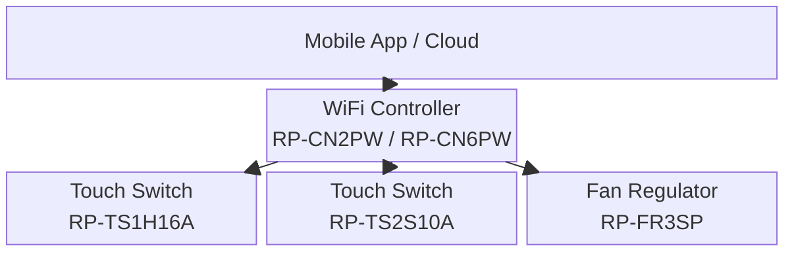

# System Architecture

## Overview

_Add a high-level description of the Rupin system here — what it does, how it's used, and what problem it solves._

---

## System Block Diagram

_Replace or extend this diagram with your actual communication topology._

---

## Board Roles

| Board | Role | Interfaces |
|-------|------|-----------|
| RP-CN2PW | 2-channel WiFi controller — bridges app to load boards | WiFi, _[add protocol]_ |
| RP-CN6PW | 6-channel WiFi controller | WiFi, _[add protocol]_ |
| RP-TS1H16A | 1-channel touch switch — detects touch, drives relay | _[add protocol]_ |
| RP-TS2S10A | 2-channel touch switch — detects touch, drives relays | _[add protocol]_ |
| RP-FR3SP | 3-speed fan regulator | _[add protocol]_ |

---

## Communication Architecture

_Describe the communication protocol between boards (e.g. UART, I2C, RS485, proprietary). Include baud rates, addressing scheme, packet format if applicable._

---

## Power Architecture

_Describe how each board is powered — mains input, SMPS, LDO, operating voltages (3.3V / 5V / 12V). Note which boards are mains-connected vs low-voltage._

---

## Physical / Installation Overview

_Describe how the boards are physically installed — wall boxes, DIN rail, enclosures, wiring to load._
